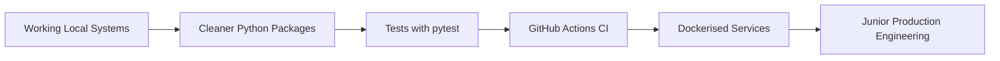

<!--
README for GitHub profile: Jake36999/Jake36999
Focus: AI Ops, local-first agent systems, RAG, data pipelines, orchestration, junior role search
-->

<div align="center">

# Hi 👋, I'm Jake McIntosh

### Self-Taught AI Ops Tinkerer · Local-First Agent Systems Builder · Data Pipeline Orchestrator

<p>
  
</p>

<p>
  <a href="https://github.com/Jake36999">
    
  </a>
  <a href="https://www.linkedin.com/in/jake-l-mcintosh-data-ops">
    
  </a>
  
  
</p>

</div>

---

## 🧭 About Me

I build **local-first AI systems** that connect agents, tools, files, memory stores, APIs, queues, and data pipelines into working backend architectures.

I am entirely self-taught and especially interested in how information moves through a system:

```text
Files / APIs / Events
        ↓
Ingestion + Cleaning
        ↓
Queue / State / Workers
        ↓
Embedding / Search / Simulation
        ↓
Memory / Validation / Tool Calls
        ↓
Agent Output / API Response / Human Review
```

I am currently looking for an **entry-level Data Ops**, **Junior Python Developer**, or **AI/Automation Engineering** role where I can bring practical build experience, persistence, and systems thinking into a structured team.

---

## 🎯 What I’m Looking For

<table>
  <tr>
    <td width="50%">

### I can bring

- Strong self-directed learning
- Practical Python project experience
- Local AI and RAG experimentation
- Backend orchestration mindset
- Persistence with messy systems
- Documentation-heavy thinking
- Willingness to learn from code review

    </td>
    <td width="50%">

### I want to grow in

- Production Python structure
- CI/CD and GitHub Actions
- Testing with `pytest`
- Docker and deployment hygiene
- Clean API design
- Code review discipline
- Maintainable syntax and patterns

    </td>
  </tr>
</table>

---

## 🛠️ Tech Stack

### Core Languages

<p>
  
  
  
  
</p>

### AI, Data, and Search

<p>
  
  
  
  
  
  
</p>

### Backend, Tools, and Infrastructure

<p>
  
  
  
  
  
</p>

---

## 🧠 Architecture Mindset

I focus on getting large, theoretical systems to run end-to-end first.

That usually means proving the full flow works, then improving the structure:

```text
Prototype → Working Pipeline → State Tracking → Validation → Documentation → Refactor → Tests
```

I care about:

- **data movement** across tools and services;
- **agent/tool boundaries**;
- **semantic memory and retrieval**;
- **worker orchestration**;
- **local-first development**;
- **debuggable systems**;
- **clear documentation for future maintainers**.

I am still learning production polish, but I am comfortable tackling complex architectures and breaking them into inspectable parts.

---

## 📌 Featured Projects

| Project | What it Shows | Stack / Concepts |
|:--|:--|:--|
| [Agent Backend](https://github.com/Jake36999/Agent_backend) | Local agent backend with daemon logic, MCP/API gateway patterns, JSON-RPC style flow, runtime state, and semantic memory ideas | `Python` `Node.js` `SQLite` `JSON-RPC` `MCP` `RAG` |
| [Quantule Mapper](https://github.com/Jake36999/quantule_mapper) | Physics/search bench with worker orchestration, API notes, notebooks, and simulation workflow structure | `Python` `FastAPI` `Workers` `WebSockets` `Simulation` |
| [ToolSet](https://github.com/Jake36999/ToolSet) | Developer-agent utilities for large repositories, context extraction, file maps, and semantic slicing | `Python` `Repo Mapping` `Context Tools` |
| [Alethiea RAG System Legacy](https://github.com/Jake36999/Alethiea_rag_system_legacy) | Local RAG architecture exploring canonical recall, semantic retrieval, and LM Studio-style workflows | `Python` `RAG` `ChromaDB` `Local LLMs` |
| [IRER Test Bench](https://github.com/Jake36999/IRER_FOCUSED_SDG_RK4INT---test_bench) | Experimental physics/simulation framework with solver, validation, and service-style architecture | `Python` `JAX` `FastAPI` `Docker` `React` |

---

## 🧪 Project Deep Dives

<details open>
<summary><h3>🤖 Agent Backend — Local Agent Orchestration</h3></summary>

A local-first backend system exploring how agents can call tools, access memory, manage runtime state, and interact with local model workflows.

**Highlights**

- Python daemon-style backend
- MCP/API gateway thinking
- JSON-RPC style communication
- SQLite-backed runtime state
- Semantic memory and retrieval concepts
- LM Studio-compatible local LLM experimentation

**Why it matters**

This is the project that best represents my long-term direction: backend infrastructure for local AI systems.

</details>

<details>
<summary><h3>🧬 Quantule Mapper — Physics Bench + Worker Search</h3></summary>

A simulation/search environment focused on orchestrating workers, experiments, APIs, notebooks, and local runtime commands.

**Highlights**

- Worker daemon structure
- API/WebSocket notes
- Notebook walkthroughs
- Runtime command documentation
- Simulation/search experimentation

**Why it matters**

This project shows my interest in long-running systems, search loops, telemetry, and experimental infrastructure.

</details>

<details>
<summary><h3>🧰 ToolSet — Developer-Agent Workflow Utilities</h3></summary>

A collection of utilities for reducing friction when using AI agents and cloud coding platforms with large repositories.

**Highlights**

- File mapping
- Semantic slicing
- Repository context extraction
- Developer-agent workflow helpers
- Large-file and large-repo navigation support

**Why it matters**

This project shows how I think about tooling around the developer experience, not just the application layer.

</details>

---

## 📊 GitHub Stats

<div align="center">


</div>

<div align="center">


</div>

<div align="center">


</div>

---

## 🧰 Tools and Technologies

<div align="center">

<table>
  <tr>
    <td align="center" width="96">
      
      <br>Python
    </td>
    <td align="center" width="96">
      
      <br>C++
    </td>
    <td align="center" width="96">
      
      <br>JavaScript
    </td>
    <td align="center" width="96">
      
      <br>TypeScript
    </td>
    <td align="center" width="96">
      
      <br>FastAPI
    </td>
    <td align="center" width="96">
      
      <br>SQLite
    </td>
  </tr>
  <tr>
    <td align="center" width="96">
      
      <br>Docker
    </td>
    <td align="center" width="96">
      
      <br>Git
    </td>
    <td align="center" width="96">
      
      <br>GitHub
    </td>
    <td align="center" width="96">
      
      <br>VS Code
    </td>
    <td align="center" width="96">
      
      <br>React
    </td>
    <td align="center" width="96">
      
      <br>Linux
    </td>
  </tr>
</table>

</div>

---

## 🧭 Current Learning Roadmap



I am currently focusing on:

- cleaner Python module boundaries;
- `pytest` test coverage;
- GitHub Actions;
- Docker-based reproducibility;
- API documentation;
- better README structure;
- smaller, more reviewable commits.

---

## 🧩 Open Source Philosophy

My public repositories are designed to show how I think.

I keep core engines, toolchains, context extractors, mapping utilities, and experimental systems open where possible. Bespoke workflows, private agent configurations, and commercially sensitive structures stay private to respect security and IP boundaries.

The public work is meant to demonstrate:

- architecture thinking;
- persistence;
- documentation habits;
- willingness to experiment;
- ability to stitch systems together;
- areas where mentorship can sharpen the craft.

---

## 🤝 Let’s Connect

<div align="center">

I’m based in **Preston, UK** and actively looking for my first professional technical role.

I’m especially interested in **Data Ops**, **Junior Python Development**, **AI Ops**, **backend automation**, and **RAG/agent infrastructure**.

<br>

<a href="https://www.linkedin.com/in/jake-l-mcintosh-data-ops">
  
</a>

<a href="https://github.com/Jake36999">
  
</a>

</div>

---

<div align="center">

### “Building local AI systems, one daemon, vector store, queue, and broken test at a time.”

</div>
