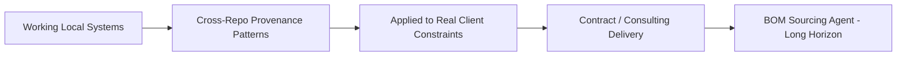

<!--
README for GitHub profile: Jake36999/Jake36999
Focus: local-first agentic AI systems, tool-calling governance, RAG memory, applied ML pipelines
-->

<div align="center">

# Hi 👋, I'm Jake McIntosh

### Local-First Agentic AI Systems · Tool-Calling Governance & Safety · Applied ML Pipelines

<p>
  
</p>

<p>
  <a href="https://github.com/Jake36999">
    
  </a>
  <a href="https://www.linkedin.com/in/jake-l-mcintosh-data-ops">
    
  </a>
  
  
</p>

</div>

---

## 🧭 About Me

I build **local-first agentic AI systems** — tool-calling architectures, RAG memory, and applied ML pipelines — with the same discipline applied everywhere: cryptographic provenance, human-in-the-loop approval gates, and honest, narrow scope claims instead of overclaiming what a system can do.

15 months self-taught, six active repositories, one consistent pattern across every one of them: systems that catch and report their own failures rather than silently shipping something that looks like it worked.

```text
Files / APIs / Events
        ↓
Ingestion + Cleaning
        ↓
Queue / State / Workers
        ↓
Embedding / Search / Simulation
        ↓
Memory / Validation / Tool Calls
        ↓
Agent Output / API Response / Human Review
```

Prior career: electronic components sales, 280 accounts. That background is why the AI systems I build default to human-in-the-loop rather than full autonomy — I've seen what a wrong automated decision actually costs.

---

## ✅ What's Proven vs. What I'm Still Building

<table>
  <tr>
    <td width="50%">

### Proven, with evidence

- Cryptographically-audited data pipelines, validated end-to-end against real production codebases
- HITL approval + rollback systems with hash-verified diffs
- 12-phase, gate-enforced development processes (289/289 tests)
- RAG memory systems with citation-required retrieval
- Local desktop AI systems used daily, not just demoed
- Reading and correctly diagnosing hardware/protocol-level incompatibilities (CSI packet-shape mismatches, driver patching)

    </td>
    <td width="50%">

### Genuinely still building

- Team collaboration on a shared codebase, at pace, under someone else's spec
- Delivery under a client deadline with external accountability
- Production traffic / real external users (everything above runs locally, for me)
- Formal algorithms/CS-fundamentals depth — self-taught, unverified against a curriculum

    </td>
  </tr>
</table>

---

## 🛠️ Tech Stack

### Core Languages

<p>
  
  
  
  
</p>

### AI, Data, and Search

<p>
  
  
  
  
  
  
</p>

### Backend, Tools, and Infrastructure

<p>
  
  
  
  
  
  
</p>

---

## 🔐 How I Build Things

Not a per-project trait — the same four habits show up independently across every repository below, in five unrelated domains:

- **Cryptographic / hash-verified audit trails.** SHA-256 hash-chained ledgers, SHA256-verified patch diffs before any code change applies, SHA1 manifest fingerprints on every file map.
- **Quarantine, never silently delete.** Bad artifacts get isolated and logged, not discarded — the failure stays inspectable.
- **Honest, narrow scope claims.** Explicit non-goal lists. A model stays labelled at exactly the confidence level it's earned, not the one that sounds better.
- **Gates that catch my own mistakes.** A readiness gate that caught a collapsed model and correctly burned it instead of shipping it. A review process that rejects unproven claims outright, including my own.

---

## 📌 Featured Projects

| Project | What it Shows | Stack |
|:--|:--|:--|
| [Custom_Agent_Forge](https://github.com/Jake36999/Custom_Agent_Forge) | Cryptographically-audited fine-tuning data pipeline, validated end-to-end against a real production codebase | `Python` `FastAPI` `Celery` `Redis` `Pydantic v2` `tree-sitter` `Docker` |
| [Mark-XLVIII](https://github.com/Jake36999/Mark-XLVIII-main) | Local desktop AI assistant I use daily — dual-mode planning with a human+model review gate before any workflow runs | `Python` `PyQt6` `MCP` `LM Studio` |
| [Agent_backend](https://github.com/Jake36999/Agent_backend) | MCP-compatible agent orchestrator with HITL-gated, hash-verified patch apply and rollback | `Python` `Node.js` `SQLite` `JSON-RPC` `MCP` |
| [remember_me](https://github.com/Jake36999/remember_me) | Local-first RAG notes app — real sync state machine, citation-required retrieval, review-first artifact generation | `Rust` `Tauri` `React` `FastAPI` `pgvector` |
| [ToolSet](https://github.com/Jake36999/ToolSet) | 12-phase, gate-enforced dev toolchain (289/289 tests) with a custom reviewer that rejects unproven claims | `Python` `MCP` `CI/CD` |
| [network_management](https://github.com/Jake36999/network_management) | Device-free RF presence sensing fused with network security correlation — proven infrastructure, open research on the model | `Python` `Intel 5300 CSI` `Wazuh` `mTLS` |
| [quantule_mapper](https://github.com/Jake36999/-quantule_mapper) | 15 months stress-testing self-derived physics reasoning through progressively rigorous simulation — ongoing by design | `Python` `JAX` `CuPy` `FastAPI` |

---

## 🧪 Project Deep Dives

<details open>
<summary><h3>🔗 Custom_Agent_Forge — Cryptographically-Audited Training Data</h3></summary>

**Problem:** fine-tuning on a codebase usually means dumping files at an LLM and hoping the examples are correct, with no way to prove after the fact that a row wasn't hallucinated.

**What I built:** a five-layer pipeline (ingest → topology → semantic projection → strict validation → synthesis) that produces ChatML/QLoRA training data with a SHA-256 hash-chained ledger tracing every accept/reject decision, plus cycle-quarantine handling for the circular dependencies real codebases actually have.

**Proof:** V2.0 run against `encode/starlette` — 1,615 nodes extracted, 198 cycle-quarantined, 6,994 ledger entries at 100% verified integrity, 427 tests passing, 1.17M-row output matrix.

</details>

<details>
<summary><h3>🤖 Mark-XLVIII — Local Desktop AI Assistant</h3></summary>

**Problem:** most personal AI assistant projects are demos. I wanted something I'd actually trust to run my own workflows daily.

**What I built:** a fully local runtime (no cloud dependency for any core capability) with dual-mode planning — either a reviewable Markdown plan or a Canvas graph, both compiling to version-bound run artifacts, gated behind a human+model dual-critic review before anything executes.

**Proof:** it's my daily driver — commits land against it most days, and everything distinctive about it (planning, memory, vision, the safety layer) is original work, not a fork of its open-source foundation.

</details>

<details>
<summary><h3>🛡️ Agent_backend — MCP Orchestrator with Governed Patching</h3></summary>

**Problem:** letting an agent modify code directly is a liability unless every change is verifiable and reversible.

**What I built:** a local MCP-compatible orchestrator where code patches require an explicit approval record and a SHA256 diff match before applying, with automatic snapshot-based rollback.

**Proof:** `v0.2.0-wave1-pipeline-bindings`, 264 Python + 25 Node tests passing per the last audit.

</details>

<details>
<summary><h3>🧠 remember_me — RAG Notes That Don't Lie About Their Sources</h3></summary>

**Problem:** most RAG note apps will answer confidently even when nothing relevant was actually indexed.

**What I built:** a local-first notes app with a real sync state machine (capture always succeeds even with the backend down), citation-required retrieval that says "not found" instead of guessing, and review-first artifact generation that never auto-commits.

**Proof:** working end-to-end — local capture, backend sync with retry/backoff, lexical and semantic search, citations on every result.

</details>

<details>
<summary><h3>🧰 ToolSet — A Toolchain That Rejects Its Own Unproven Claims</h3></summary>

**Problem:** dev tooling quietly rots when nothing enforces that "done" actually means tested and working.

**What I built:** a 12-phase rebuild of a repo-analysis toolchain, each phase gated behind passing tests and explicit approval, enforced by a custom reviewer that rejects any change lacking actual terminal-verified proof — editor diagnostics don't count.

**Proof:** 289/289 tests passing across all 12 phases, plus CI running the full matrix on every push.

</details>

<details>
<summary><h3>📡 network_management — RF Sensing Fused with Security Correlation</h3></summary>

**Problem:** device-free presence sensing (Wi-Fi CSI) and network security monitoring are normally separate disciplines with no shared timeline.

**What I built:** a hybrid node that captures Intel 5300 CSI over a patched driver, bridges it across hosts via mTLS, and correlates it against network recon telemetry into a single SIEM timeline — locked and proven as of June 2026. The presence-sensing model itself is honest open research: the off-the-shelf model I tried first didn't fit the richer CSI shape my hardware produces, so I'm training a narrowly-scoped classifier from scratch instead of overclaiming a fix.

**Proof:** infrastructure verified and repeatable; the model work has a readiness gate that already caught and correctly discarded one bad training run rather than shipping it.

</details>

---

## 📊 GitHub Stats

<div align="center">


</div>

<div align="center">


</div>

<div align="center">


</div>

---

## 🧰 Tools and Technologies

<div align="center">

<table>
  <tr>
    <td align="center" width="96">
      
      <br>Python
    </td>
    <td align="center" width="96">
      
      <br>Rust
    </td>
    <td align="center" width="96">
      
      <br>JavaScript
    </td>
    <td align="center" width="96">
      
      <br>TypeScript
    </td>
    <td align="center" width="96">
      
      <br>FastAPI
    </td>
    <td align="center" width="96">
      
      <br>Redis
    </td>
  </tr>
  <tr>
    <td align="center" width="96">
      
      <br>Postgres
    </td>
    <td align="center" width="96">
      
      <br>SQLite
    </td>
    <td align="center" width="96">
      
      <br>Docker
    </td>
    <td align="center" width="96">
      
      <br>Git
    </td>
    <td align="center" width="96">
      
      <br>Linux
    </td>
    <td align="center" width="96">
      
      <br>React
    </td>
  </tr>
</table>

</div>

---

## 🧭 Current Direction


```mermaid
flowchart LR
    A[Working Local Systems] --> B[Cross-Repo Provenance Patterns]
    B --> C[Applied to Real Client Constraints]
    C --> D[Contract / Consulting Delivery]
    D --> E[BOM Sourcing Agent - Long Horizon]
```

I'm currently focused on:

- turning proven local systems into paid AI training/evaluation work;
- applying the same governance patterns to real client problems, not just personal infrastructure;
- a long-horizon project applying my sourcing/procurement background (280 accounts, electronic components) to an agent that helps independent brokers cross-reference obsolete and allocation-constrained parts.

---

## 🧩 Open Source Philosophy

My public repositories are designed to show how I think, not just what I built.

I keep core engines, toolchains, context extractors, and experimental systems open where possible. Bespoke workflows, private agent configurations, and commercially sensitive structures stay private to respect security and IP boundaries — and where a project builds on someone else's open-source foundation, that foundation is credited and its license respected, not quietly absorbed.

The public work is meant to demonstrate:

- provenance and audit-trail thinking, applied consistently rather than as a one-off feature;
- honest scope — claiming exactly what's proven, no more;
- persistence through genuine dead ends (adapting hardware, discarding a bad model, changing direction when the evidence says to);
- ability to stitch systems together end-to-end, not just in isolation.

---

## 🤝 Let's Connect

<div align="center">

I'm based in **Preston, UK**, and open to **AI training/evaluation contract work**, **agent systems consulting**, and **backend automation** engagements.

I lead with evidence, not job titles — the repositories above are the actual argument.

<br>

<a href="https://www.linkedin.com/in/jake-l-mcintosh-data-ops">
  
</a>

<a href="https://github.com/Jake36999">
  
</a>

</div>

---

<div align="center">

### "Trust, but verify — the principle behind every audit trail, approval gate, and honest scope claim above."

</div>
